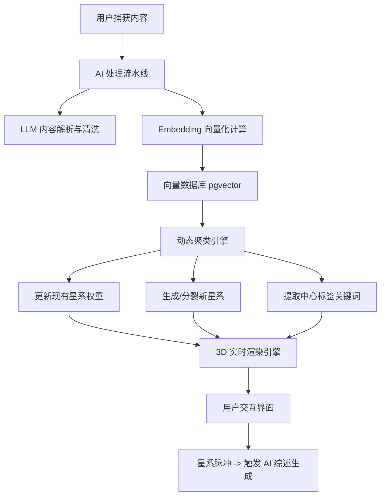

# NeoFeed 知识星系 2.0 —— 从碎片存储到结构化认知的进化方案

## 1. 迭代背景与目标

目前 NeoFeed 已实现信息的高效捕获与初步展示，但随着用户存储内容的指数级增长，单一列表或混乱的 3D 云图将导致认知过载。

**核心目标：**
*   **自动化分类**：利用 AI 彻底取代手动文件夹，实现“存入即归类”。
*   **结构化呈现**：通过“多星系集群”视觉隐喻，让用户一眼洞察自己的知识版图。
*   **生产力触发**：将星系作为“知识孵化器”，在信息密度足够时主动催写总结。

---

## 2. 产品形态设计 (Product Form)

### 2.1 多星系集群 (The Multi-Galaxy Cluster)
产品进入后的核心看板不再是一个单一的大球，而是散布在深空中的多个**星系簇**。
*   **中心标签 (Core Label)**：每个星系中心有一颗高亮的“恒星”，悬浮显示由 AI 提取的主题关键词（如：#LLM技术、#产品心理学）。
*   **色彩编码**：不同领域的星系拥有专属色调，通过视觉心理强化分类感知。

### 2.2 星系进化等级 (Evolutionary Levels)
星系的表现形式随节点（内容）数量动态变化：
*   **初生星云 (Nebula)**：内容少于 5 条，视觉呈现为稀疏的散点和淡淡的光晕，代表正在探索的新兴趣。
*   **成长星系 (Growth)**：内容 5-20 条，形成明显的旋涡引力场，轨道清晰，中心标签亮度增加。
*   **成熟脉冲 (The Pulse)**：内容超过 20 条，星系进入“高能态”。中心标签产生有节奏的**呼吸脉冲特效**，并出现“晶体”图标，提示用户该领域知识已具备“产出条件”。

### 2.3 动态数据流 (Data Meteors)
*   **归位动画**：新捕获的内容以“星尘”形式出现，随后被特定星系的引力牵引，划过屏幕落入所属星系。
*   **跨界流星**：当 AI 发现两个星系之间存在语义关联时，会有细微光束（虫洞）或流星穿梭其间，引导用户发现跨学科联系。

---

## 3. 技术实现方案 (Implementation Plan)

### 3.1 语义引力模型 (Semantic Gravity Model)
将抽象的“相关性”转化为具象的“空间位置”：
*   **向量化 (Embedding)**：使用 `text-embedding-3-small` 接口将每条内容转化为 1536 维向量。
*   **余弦相似度 = 引力常数**：计算新内容向量与现有各星系中心向量的余弦相似度，相似度越高，引力 $F$ 越大。
*   **坐标投影 (DR)**：利用 t-SNE 或 UMAP 算法将高维向量降维至 3D 空间坐标，确定星球的初始落点。

### 3.2 动态动态聚类算法 (Clustering Strategy)
*   **DBSCAN (Density-Based Spatial Clustering)**：
    *   **原理**：无需预设分类数量，根据点密度自动识别“簇”（星系）和“噪点”（未分类碎片）。
    *   **自动分裂**：当某个星系内部出现两个明显的密度核心时，算法自动执行分裂逻辑，视觉上表现为星系“有丝分裂”。
*   **LLM 语义提炼**：对聚类成功的节点集，调用 GPT-4o 总结出 1-3 个覆盖度最高的关键词，更新为星系中心标签。

### 3.3 表现层渲染 (Rendering Engine)
*   **Three.js + React-three-fiber (R3F)**：负责高性能 3D 粒子渲染。
*   **物理引擎 (Rapier)**：为每个星系中心设置万有引力场，实现星球绕转、吸入等真实物理效果。
*   **Shader 动效**：使用自定义着色器（GLSL）实现星系的脉冲波、呼吸光晕和数据流星的拖尾效果。

---

## 4. 技术架构 (Technical Architecture)

### 4.1 核心组件职责
1.  **Ingest Pipeline (Next.js Edge Functions)**：负责高并发的内容接入与预处理。
2.  **Vector Store (PostgreSQL w/ pgvector)**：存储内容向量，支持毫秒级的相似度检索。
3.  **Clustering Worker**：定时或按需运行的后台任务，维护星系图谱的最新拓扑结构。
4.  **Client-side R3F Engine**：将后端的坐标和逻辑转化为丝滑的 3D 视觉反馈。

---

## 5. 阶段规划

*   **Phase 1 (MVP)**：在产品内实现基于手动标签的简单多星系展示，跑通 R3F 多中心引力场逻辑。
*   **Phase 2 (智能进化)**：接入 Embedding 和 DBSCAN 自动聚类，实现星系中心标签的 AI 自动生成。
*   **Phase 3 (深度结构化)**：实现星系进化等级视觉系统、脉冲催写功能以及跨星系语义虫洞。

